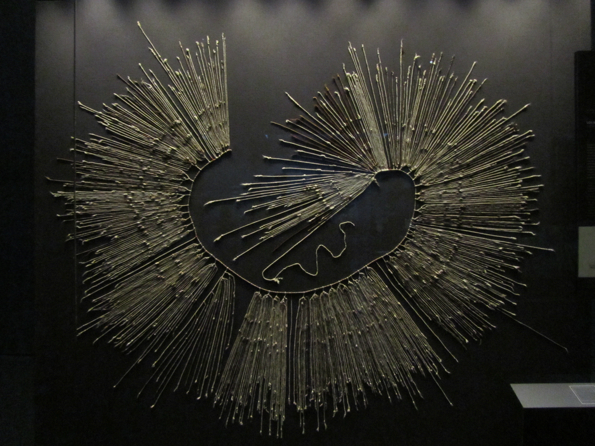
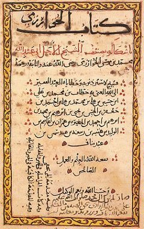
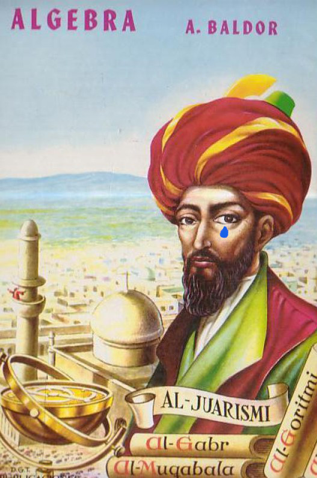

# Álgebra

### Objetivo de la Unidad

Repasar los conceptos básicos del álgebra y usarla como herramienta para abstraer ideas visuales en operaciones numéricas.

### ¿Que estudian las Matemáticas?

Las **Matemáticas** son una disciplina muy antigua, cuyas ideas han ido evolucionado a lo largo de la historia de la humanidad. Es quizá uno de los mayores logros intelectuales que como colectivo hemos conseguido.

Su trascendencia se debe a que nuestra naturaleza física está diseñada para detectar patrones y tener capacidad de abstracción. Pero sobre todo porque son muy prácticas y nos ayudan a sortear las multiples dificultades de este mundo caótico.

La primer necesidad humana que fue cubierta por las Matemáticas fue la necesidad de contar. Establecer una relación entre una cantidad física y una abstracta nos ayudo a distribuir y administrar bienes. Sin ello, no se hubieran podido crear sociedades avanzadas. De aquí surgió el concepto de **número**.

Mas adelante surgieron mas formas de abstraer patrones del mundo real y después se estudiaron mas a fondo.

> _"Las Matemáticas estudian, partiendo de axiomas y la lógica, las propiedades, relaciones y estructuras de entidades abstractas."_

### ¿Que es el álgebra?

Alrededor del año 820, en la ciudad de Bagdad, el matemático Al-Khwarizmi (en español Al-Juarismi) publicó un tratado llamado _Hisāb al-ŷabr wa'l muqābala_, que significa _Compendio de cálculo por compleción y comparación_.

En este libro Al-Juarismi expone muchos métodos para resolver problemas de la vida cotidiana del imperio islámico de su época. Los problemas que resolvía se centraban en cálculos de cantidades de dinero, de bienes, de propiedades, etc.

De esta obra nace el término **álgebra**, y establece muchas ideas actuales de esta area.

Y lamentamos romper ilusiones y creencias, pero el señor de la portada de este libro ¡no es Baldor!. Es Al-Juarismi.

#### Abstracción

El proceso de _abstraer_ es capturar la **esencia** de un objeto vive en el mundo real o concreto. Es decir, queremos dejar de lado los detalles innecesarios y superfluos para describir una idea o concepto.

Usemos de ejemplo la descripción de una silla. Si yo busco la palabra "silla" en Google Imágenes, encontrare estos resultados.

Todas estas imágenes son ejemplos de sillas muy distintas y concretas. Lo importante para definir la idea "silla" son sus similitudes y su esencia.

Lo mismo pasa con las cantidades. El número 5, tiene muchas formas de ser representado con objetos concretos, pero la esencia es la cantidad.

Mas aún, el 1, 200, -20 son ejemplos concretos del concepto "número". Que podemos simbolizar con la letra "x".

#### Del lenguaje común a expresiones algebraicas

Una vez entendido que las letras pueden abstraer una cantidad, podemos crear expresiones simbólicas que representen relaciones de cantidades.

Imaginemos que voy al tianguis y veo que la verdura tiene un descuento del 30% de descuento. El kilo de limones esta en $20 pesos, por lo tanto el descuento si compro un kilo es:

Si yo generalizo el descuento para cualquier porcentaje y cualquier verdura puedo escribirlo como:

Si d es el descuento, p es el porcentaje y x es el precio de la verdura.

### Operaciones aritméticas y sus propiedades

#### Suma

#### Resta

#### Multiplicación

#### División

### Ecuaciones de primer grado

### Rangos de números
