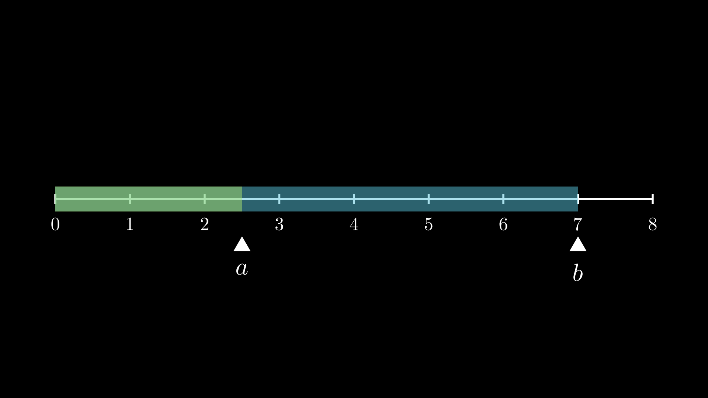

# Operaciones básicas y sus propiedades

A continuación revisaremos las operaciones básicas usadas en las expresiones algebraicas y sus propiedades.

### Suma

La suma se usa para agregar cantidades. También está relacionada con "mover" o "empujar" un _offset_.

En matemáticas y en programación se usa el signo _+_.

https://user-images.githubusercontent.com/2686914/154769575-46f3157b-907c-482b-b1ac-cd173279b88e.mp4

En el caso de un rango de números que están entre _a_ y _b_, al sumar una cantidad, estamos "recorriendo" todos los números del rango.

https://user-images.githubusercontent.com/2686914/154863728-8e993a82-b189-4613-83a9-c78c0d220523.mp4

#### Propiedades

Sean _a_, _b_ y _c_ tres números cualesquiera.

1. 
2. _(Simetría)_ 
3. _(Asociatividad)_ 
4. Si , entonces .

### Resta

La resta es usada para disminuir cantidades, pero también sirve es una medida para determinar que tan diferentes son dos cantidades. De ahí que también se llame "la diferencia".

En matemáticas y en programación su símbolo es _-_.

Igual que la suma, visualmente lo podemos relacionar con mover, o empujar pero en el sentido contrario.

Con la resta, podemos determinar la longitud de un rango de números.

#### Propiedades

Sean _a_, _b_ y _c_ tres números cualesquiera.

1. 
2. 
3. Si , entonces .

### Multiplicación

La multiplicación esta relacionada con "escalar" una cantidad, puede ser que ampliemos la cantidad, o la reduzcamos.

La notación de la multiplicación en matemáticas se simboliza omitiendo el símbolo, o con paréntesis:  o . Mientras que en programación, se usa el asterisco `*`: `2 * x` o `a * b * c`.

Cuando multiplicamos un rango, lo podemos ampliar o reducir por un factor.

https://user-images.githubusercontent.com/2686914/155642053-bef7ceb6-d062-417e-93d2-ccad58027aff.mp4

#### Propiedades

Sean _a_, _b_ y _c_ tres números cualesquiera.

1. .
2. .
3. .
4. .
5. .
6. Si , entonces .

### División

El significado clásico de la división es la de "repartir" o "distribuir" una cantidad sobre otra. También se le conoce como la operación inversa a la multiplicación.

En matemáticas usamos la notación , mientras que en código, se usa `/`: `a / b`.

A la cantidad a repartir se le conoce como numerador, y a la cantidad entre la que se reparte es el denominador.

El denominador NUNCA puede ser _0_.

#### Propiedades

Sean _a_, _b_, _c_ y _d_ cuatro números cualesquiera.

1. .
2. .
3. .
4. .
5. .
6. .
7. Si , entonces .
