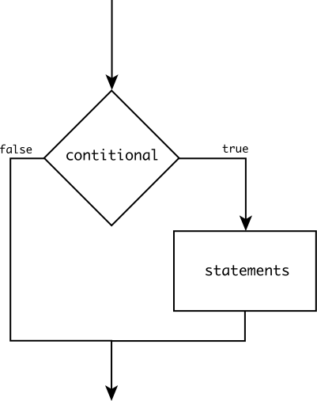

# Condicionales

### Expresiones booleanas y proposiciones

En el estudio de la Lógica, a las oraciones que se les puede conceder el valor de falso o verdadero se le conoce como **proposiciones**.

En los ejemplos:

1. Tengo hambre.
2. ¡Viva la Revolución!
3. Esta lloviendo.
4. x = y + 2
5. 50 > 10

Las oraciones 1, 3 y 5 son proposiciones; mientras que 2, y 4 no lo son.

A las proposiciones también se les conoce como **expresiones booleanas**. Dado que el estudio de este tipo de expresiones y su relación con la computación fue hecha por _George Boole_.

A los valores _falso_ o _verdadero_ se les conoce como valores booleanos, y en Javascript los podemos guardar en variables como los valores `false` o `true`.

### Operadores de comparación

Las expresiones booleanas más comunes que escribiremos en código son comparaciones de valores. A continuación ponemos los operadores de comparación que se usan en Javascript:

- Mayor que (`>`)
- Mayor que (`<`)
- Mayor o igual que (`>=`)
- Menor o igual que (`<=`)
- Es igual que (`===`)\*
- Es diferente que (`!==`)\*

\* Javascript es un lenguaje algo rarito, y se sugiere usar estos operadores a diferencia de `==` y `!=`.

Estos operadores se pueden combinar igual usando la asociación (), como sucede con los operadores aritméticos.

### Condicionales

En la mayoría de los programas (y algoritmos) se necesitan tomar decisiones. Se decide si se debe ejecutar o no ciertas instrucciones en base al estado de las variables o al contexto. Es decir, ciertos pasos del algoritmos están condicionados.

Las condiciones es algo con lo que estamos acostumbrados a lidiar todos los días de nuestra vida. Tanto en la vida real, como en los programas, las condicionales tienen la misma forma: Si es cierto que _A_, entonces sucede _B_.

Por ejemplo:

- Si tengo hambre entonces como una hamburguesa. Si no tengo hambre, pero tengo sed, entonces bebo agua.
- Si estudio, seguro aprobaré la materia.
- Si el usuario da click sobre la nave y no ha perdido, entonces dispara.

### Condicional simple

Una condicional simple tiene la forma que hemos discutido anteriormente:

> Si es cierto que _A_, entonces ejecuta _B_.

Donde _A_ es la **condición** y siempre es una expresión booleana. Mientras que _B_ es el bloque de líneas de código que se ejecuta cuando _A_ es verdadero.

Si vemos esto como un diagrama de flujo:

