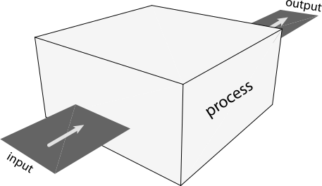
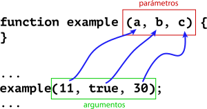

# Funciones

A medida que un programa crece y realiza muchas tareas, se vuelve necesario tener una forma eficiente de organizar el código. Aunque cada lenguaje de programación tiene sus formas de hacerlo, en casi todas, la unidad mínima de organización son las _funciones_.

Una **función** es un bloque de código aislado que se utiliza para realizar una sola tarea.

En algunos lenguajes puede ser llamado método, subrutina o subprograma.

### Declaración y uso

Para declarar una función en JavaScript se usa la sintaxis:

```js
function functionName () {
  // Código de la función
}
```

El nombre debe seguir las mismas reglas que el nombre de una variable.

Una vez definida la función, se puede usar poniendo su nombre seguido de paréntesis:

```js
functionName();
```

Al hecho de usar una función, también se le dice _invocar_ o _llamar_ a una función.

#### Ejemplo

```js
function draw() {
  background(220);

  randomBlackCircle();
  randomBlackCircle();
  randomBlackCircle();
}

function randomBlackCircle() {
  let diameter = random(30, 60);
  fill(0);
  noStroke();
  ellipse(random(width), random(height), diameter, diameter);
}
```

Este ejemplo lo puedes encontrar [aquí](https://codesandbox.io/s/black-circles-70ld2).

### Propiedades de una función

Las funciones tienen tres principales particularidades: _modularidad_, _abstracción_ y _reusabilidad_.

* **Modularidad**

  Las funciones permiten descomponer y separar la totalidad de un programa en pequeñas porciones mas simples. Al concentrarnos en resolver y programar una sola tarea reducimos la complejidad, y limitamos los errores.

  Una vez que nos aseguramos que las pequeñas partes funcionan, se unen y combinan para crear tareas mas complejas.

* **Abstracción** 

  Como consecuencia de la modularidad añadimos capas de abstracción a nuestro código. Al delegar la implementación de cada tarea a su función, nos dejamos de preocupar por los detalles específicos y solo nos preocupamos por como usarlos.

  En el ejemplo de los círculos negros, solo mandamos a llamar `randomBlackCircle` y nos olvidamos de cómo esta implementado. Solo nos interesa saber que dibujar un circulo negro aleatorio.

* **Reusabilidad**

  Una vez definida una función se puede usar tantas veces como uno quiera. Esto es muy útil pues evita que repitamos código que hace lo mismo una y otra vez.

  Existe un principio en la programación: _DRY (Don't repeat yourself)_.

### Modelo IPO

Las funciones siguen el modelo IPO: _Input, Process, Output_.



Son como cajas que reciben, o no, datos de entrada (input). Dentro ejecutan instrucciones (process). Y regresan, o no, datos de salida (output).

### Parámetros

A los datos de entrada que recibe una función los llamamos **parámetros**.

La sintaxis para aceptar parámetros en una función es la siguiente:

```js
function name (param1, param2, ..., paramN) {
  // Código de la función
}
```

Los parámetros son como variables cuyo valor es dado cuando se invoca a la función. Estos valores se conocen como **argumentos**.

Los argumentos se asignan a los parámetros en el orden que aparecen.



#### Ejemplo

```js
let size = 100;

function eye(x, y, eyeSize) {
  noStroke();

  fill(255);
  ellipse(x, y, eyeSize, eyeSize);

  fill(0);
  ellipse(x + eyeSize * 0.25, y, eyeSize * 0.5, eyeSize * 0.5);

  fill(255);
  ellipse(x + eyeSize * 0.4, y - eyeSize * 0.1, eyeSize * 0.1, eyeSize * 0.1);
}

function draw () {
  background(200);

  eye(300, 400, 100);
  eye(550, 400, size);
  eye(mouseX, mouseY, 75);
}
```

Puedes encontrar el ejemplo completo [aquí](https://codesandbox.io/s/eyes-function-jkowc).

### Regreso de valores

### Las funciones `setup` y `draw`

### Funciones de primer grado
