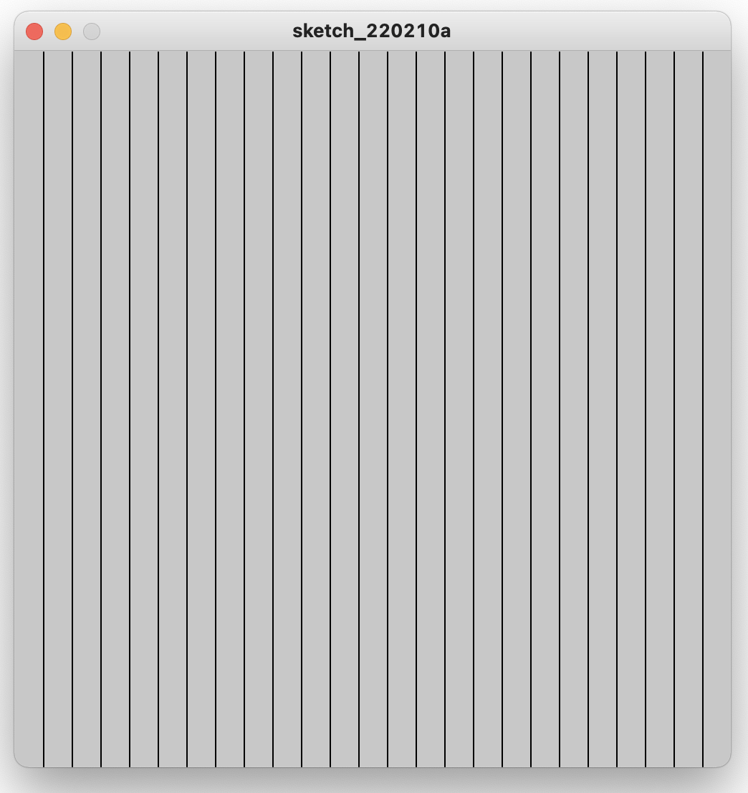

# Repeticiones (Ciclos o iteraciones)

Las computadoras nos hacen la vida más fácil haciendo tareas tediosas para nosotros. Ellas son especialmente buenas para automatizar procesos que son repetitivos, porque lo hacen mucho más rápido que de forma manual.

¿Qué tan rápido? Pues pueden hacer aproximadamente 3,600,000,000 de operaciones al segundo (3.6 GHz). Es decir, muy rápido.

Por lo tanto, podemos sacar ventaja de esa rapidez aprendiendo como hacer que la computadora repita tareas o instrucciones.

### Estructura `while`

Supongamos que queremos llenar el canvas de líneas verticales como se muestra en la imagen.



Una forma de lograrlo sería:

```js
let x = 20;
line(x, 0, x, height);

x = x + 20;
line(x, 0, x, height);

x = x + 20;
line(x, 0, x, height);

// Hasta llenar el canvas...
```

Pero esto obviamente es muy poco practico. Si cambiamos el tamaño del canvas, tendríamos que agregar o quitar código. O si queremos cambiar la separación entre las líneas, tendríamos que modificar mucho código.

En este código hay dos instrucciones que se repiten: la actualización de la variable `x` y el dibujo de la línea. Podemos resumir nuestras intenciones con las instrucciones:

> Mientras que la x no llegue al final del canvas, avanza x en 20 y dibuja una línea vertical.

La frase _"mientras que"_, establece que se debe repetir instrucciones hasta que se cumpla una condición. En este caso la condición es que `x` no llegue al final (`x < width`).

El diagrama de flujo que representa este pequeño algoritmo es:


#### Sintaxis

La sintaxis para indicar repeticiones hasta que, o mientras que se cumpla una condición es:

```js
while (condition) {
  // Instrucciones a repetir
}
```

En nuestro ejemplos de las líneas verticales:

```js
let x = 0;
while (x < width) {
  x = x + 20;
  line(x, 0, x, height);
}
```

El código completo lo puedes encontrar [aquí](https://codesandbox.io/s/while-lines-rv772).

### Ciclos infinitos

### Estructura `for`

### Dobles iteraciones
